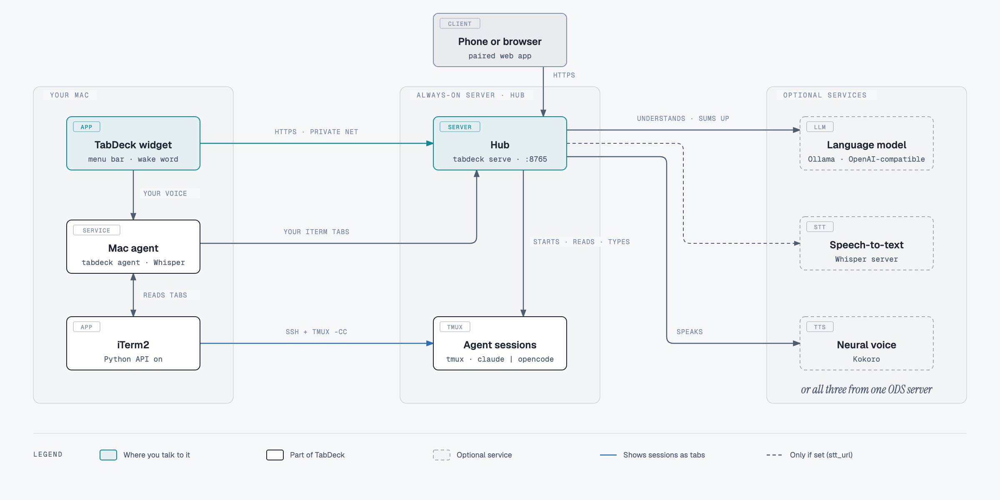
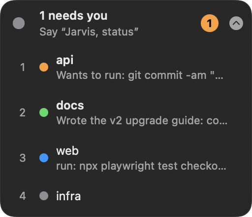
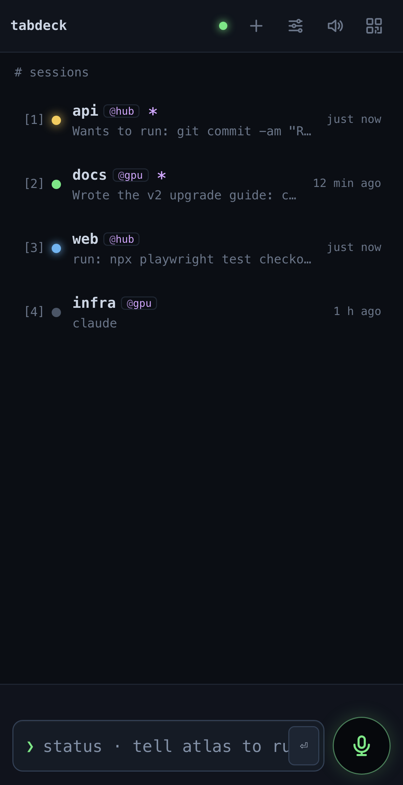
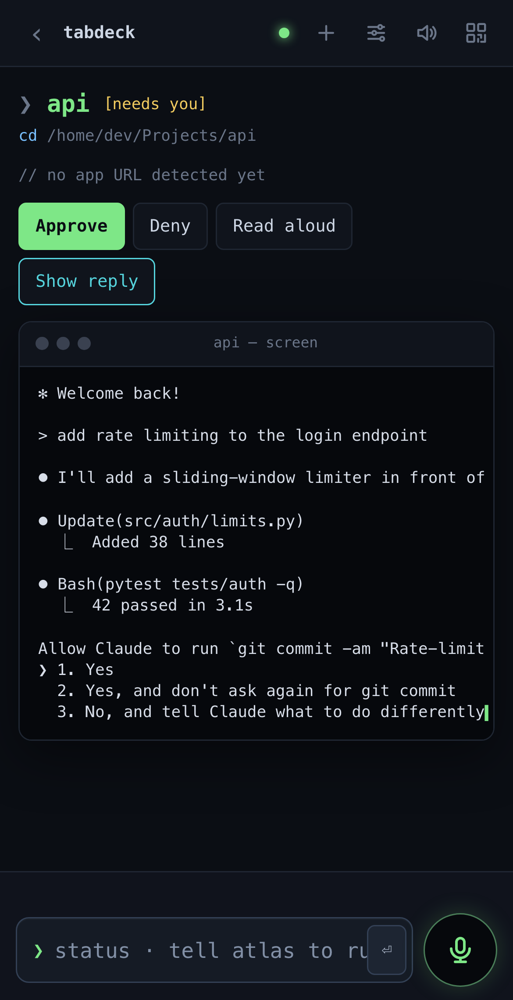
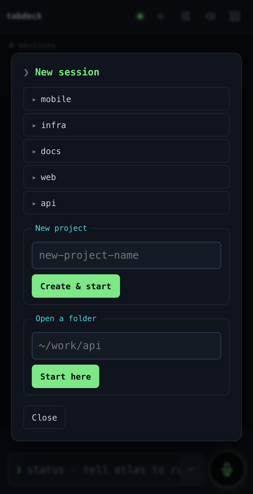
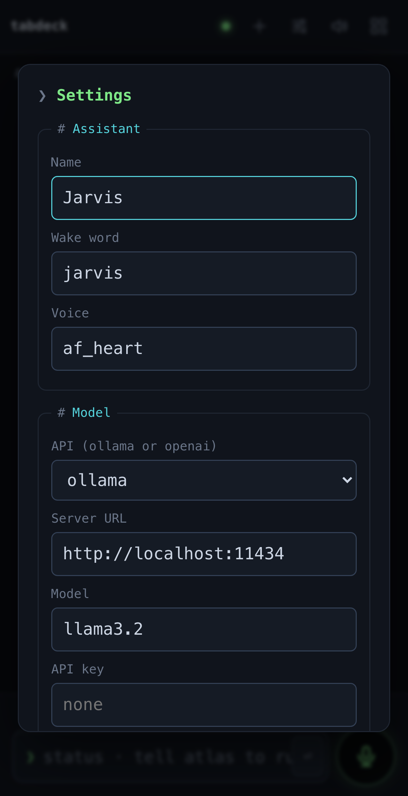

# TabDeck

Voice-first control of always-on coding-agent sessions (**Claude Code** or **OpenCode**) from your phone, a web
page and your Mac. Sessions live in tmux on a server, keep running when your laptop sleeps, and appear in iTerm2 as
normal tabs. An assistant with a wake word ("Jarvis, what's going on?") tells you what each session is doing, reads
replies aloud, and approves, replies to or starts sessions.

TabDeck can use your own model and speech services, for example an [ODS](https://github.com/Osmantic/ODS) server
for the language model, Whisper and Kokoro.

## How it fits together
TabDeck has two halves: **your Mac** (the widget and a small agent) and **an always-on Linux server**, called the
hub, where the sessions live. The widget alone does nothing: it talks to the hub, and `tabdeck setup` installs both
halves.

<picture>
  <source media="(prefers-color-scheme: dark)" srcset="docs/architecture-dark.png">
  
</picture>

**On your Mac**, the widget floats above your windows: a one-line status that listens for the wake word, and a
click opens every session (the chevron tucks it into the menu bar):

<p>
  
  &nbsp;
  
</p>

**On your phone or in a browser** (the paired web app; the same sessions, from anywhere on your private network):

| Sessions at a glance | Approve, deny or reply | Start a session | Settings, live |
|:---:|:---:|:---:|:---:|
|  |  |  |  |

| Where | What runs there | Installed by |
|---|---|---|
| **Mac** | the widget, the Mac agent, iTerm2, Whisper (on Apple silicon, unless you use a speech server) | `tabdeck setup` (you install iTerm2, Xcode tools, uv, mkcert) |
| **Always-on server** | the hub (web page, phone app, assistant), tmux, Claude Code or OpenCode, cron for reboot resume | `tabdeck setup`, over ssh (you install tmux and the coding agent) |
| **Phone / browser** | nothing to install: pair it and add the page to the Home Screen | `tabdeck pair` |
| **Services** | a language model, speech-to-text and a voice, all optional | yours, or all three from one [ODS](https://github.com/Osmantic/ODS) server |

**Services, and what happens without them:**
- **Language model** (Ollama, or any OpenAI-compatible server such as ODS's LiteLLM): understands free-form
  requests and summarises sessions. Without it, TabDeck understands a fixed set of commands ("status", "approve",
  "go to api").
- **Speech-to-text**: Whisper runs on the Mac by default. Set `stt_url` to use a Whisper server instead, e.g. ODS's.
- **Voice** (a Kokoro server, e.g. ODS's): the neural voice. Without it, the widget speaks with a macOS voice.
- **ODS** provides all three plus OpenCode, so one ODS server can be the whole right-hand side: run
  `tabdeck setup --ods` against it.

## Quickstart
### Prerequisites
`tabdeck setup` checks these first and tells you how to fix anything missing.

**On the Mac**
- macOS 14 or newer.
- **iTerm2** with its **Python API enabled**: iTerm2 → Settings → General → Magic → *Enable Python API*. The Mac
  agent reads your tabs and opens the tmux tabs through it. TabDeck sets iTerm's tmux-integration options itself:
  tmux windows open as tabs in the current window, and the connection session is hidden.
- **Xcode Command Line Tools**: `xcode-select --install`. This builds the widget.
- **[Homebrew](https://brew.sh)** and **mkcert**: `brew install mkcert`. This creates the local HTTPS certificates.
- **[uv](https://docs.astral.sh/uv/)**: `curl -LsSf https://astral.sh/uv/install.sh | sh`.
- Microphone access for the widget, which macOS asks for on first use.

**On the hub server** (Linux with systemd)
- **ssh from the Mac with a key**, no password prompt.
- **tmux** 3.2 or newer: `sudo apt install tmux`.
- **Claude Code** (`curl -fsSL https://claude.ai/install.sh | bash`, then run `claude` once to log in), or **OpenCode**
  (it ships with [ODS](https://github.com/Osmantic/ODS)).
- **systemd lingering**: `sudo loginctl enable-linger $USER`. The hub and your sessions then keep running when
  you're logged out, and start at boot.
- **cron**: `sudo apt install cron`. It saves your sessions every minute, so they come back after a reboot.
- Optional: a model server for the assistant (Ollama, or ODS), and a Kokoro voice server for the neural voice.

**Network:** a private network between the Mac, the hub and your phone, such as NetBird, Tailscale or WireGuard.

### Install
```sh
git clone https://github.com/haj/tabdeck.git && cd tabdeck
uv sync
uv run tabdeck setup        # asks 3–4 questions, deploys the hub, installs the Mac agent and the widget
```

Then say **"Jarvis, what's going on?"**.

**The wake word.** A new installation answers to **"Jarvis"**; "Hey Jarvis" and "Okay Jarvis" work too. It has to
start what you say (or a sentence), so "tell Jarvis…" in the middle of a sentence doesn't wake it. To use another
name, answer `setup`'s *Assistant name* question (the wake word follows it, e.g. Friday → `friday`), or pass
`--assistant Friday --wake "hey friday"`. You can change both at any time from the widget (menu bar icon →
**Settings…**) or the ⚙ sheet on the web page; the change applies at once.

`setup` ends by pairing this Mac's browser and showing a QR code: scan it
with your phone, then add the page to the Home Screen. To pair more devices later, run `tabdeck pair` or use the
widget menu → **Pair a phone…**. Everything is configurable later from the widget (click the menu bar
icon → **Settings…**), and **Help…** in the same menu explains the rest.

**Prebuilt widget.** Each [release](../../releases) has `DeckWidget.zip`. Unzip it into `~/Applications`, then
right-click → *Open* the first time, because it is not notarized. `tabdeck setup` builds the widget from source
anyway.

## Pieces
- **Hub** (`tabdeck serve`, Linux server, systemd user service). Serves the web page and API. Each agent session
  is a window of one tmux session (default `deck`); the tmux server has its own service, so deploys never end
  sessions. `deck-save.sh` (cron, every minute) and `deck-start.sh` (at boot) bring sessions back after a reboot,
  resuming each folder's last conversation.
- **Status.** Claude Code reports through its hooks (`hooks/tabdeck-hook.sh`); OpenCode through a plugin
  (`opencode/plugin/tabdeck.js`) that posts the same events. Both give working / needs you / done, the last reply,
  spoken summaries and read-aloud.
- **Mac agent** (`tabdeck agent`, launchd). Keeps an iTerm tmux-integration (`tmux -CC`) connection to every
  reachable server, so each session window is an iTerm tab. It can also report the Mac's own iTerm tabs to the hub.
- **Widget** (`widget/`, SwiftUI). A floating, always-listening assistant with a wake word, voice activity
  detection and neural text-to-speech.
- **Phone.** The web page, added to the Home Screen.

## Configuration
Everything that differs between setups is in `<data dir>/settings.json`. The data dir is `~/.tabdeck`, or
`~/.tabdeck-<name>` with `TABDECK_INSTANCE=<name>`, so two setups can run side by side with separate ports, launchd
jobs, cron lines and tmux sessions.

| Setting | Default | Meaning |
|---|---|---|
| `agent` | `claude` | `claude` or `opencode` |
| `assistant_name` / `wake_word` | `Jarvis` / `jarvis` | what the assistant is called and answers to; any word or two, e.g. `Friday` / `hey friday` |
| `port` | `8765` | hub and Mac agent port |
| `tmux_session` | `deck` | tmux session on servers |
| `projects_dir` | `~/Projects` | the hub's projects folder: ＋ lists its folders, and *New project* creates one there |
| `llm_api`, `llm_url`/`ollama_url`, `intent_model`, `llm_key` | Ollama on localhost | the assistant's model; `openai` for OpenAI-compatible servers (e.g. ODS LiteLLM) |
| `stt_url` | (empty: Whisper on the Mac) | OpenAI-compatible speech-to-text, e.g. ODS Whisper |
| `tts_url`, `tts_voice` | (empty: system voice) | OpenAI-compatible text-to-speech (Kokoro) |
| `mac_tabs` | `true` | the Mac agent also reports the Mac's own iTerm tabs |

## Setup
You need a private network between the hub, the Mac and the phone (NetBird, Tailscale, WireGuard): TabDeck is
not designed to be exposed to the internet (see `SECURITY.md`). You also need ssh from the Mac to the hub with a
key.

```sh
make install-deps     # uv sync
uv run tabdeck setup  # asks a few questions, detects the rest over ssh, then deploys and installs
```

`tabdeck setup` does the following:
- asks for the hub's ssh target;
- detects its private-network IP (from NetBird, if it runs there), its name, and whether ODS is installed;
- suggests the agent, assistant name, wake word and port;
- writes the untracked `deploy.env` and this Mac's `settings.json` and `servers.json`;
- offers to deploy the hub, install the Mac agent and build the widget.

Every answer is also a flag (`tabdeck setup --help`). For example, a second setup next to the first:
```sh
uv run tabdeck setup --instance gpu --host me@gpu-server --agent opencode --ods   # port 8766; --ods: use ODS's services
```
Pair phones and browsers with `tabdeck pair` (a QR code and link) or the widget menu → **Pair a phone…**.

## Using it
**Starting a session:**
- a project from the ＋ list (the folders in the projects folder);
- *New project* (creates a folder there);
- *Open a folder* with any path under the hub user's home (`~/work/api`);
- on the server, `tabdeck open ~/work/api` (or `tabdeck open` in the current folder);
- by voice: "start Claude in api".

Say **"Jarvis, what's going on?"**, **"Jarvis, start Claude on server in myproject"**, **"tell api to run the
tests"**, **"approve"** or **"catch me up"**. Everything also works from the web page. See `docs/server-sessions.md`.

## Development
`make test` (pytest; the tmux script tests need tmux). The widget: `cd widget && swift build && swift test`.

**Releases.** Push a tag such as `v0.2.0`; only repository admins can, because of the "release tags" ruleset.
`.github/workflows/release.yml` then runs three jobs:
1. **test** (no secrets): runs every test.
2. **sign** (environment `release`, usable only by `v*` tags): builds the widget app, signs it and notarizes it.
3. **publish** (no secrets): creates the GitHub Release with `DeckWidget.zip` and its SHA-256.

The signing secrets live only in the `release` environment (Settings → Environments → release):
- `MACOS_CERT_P12` (base64 Developer ID Application certificate), `MACOS_CERT_PASSWORD`;
- for notarization, either an App Store Connect API key: `APPLE_API_KEY_P8` (base64 `.p8`), `APPLE_API_KEY_ID`,
  `APPLE_API_ISSUER`; or an Apple ID: `APPLE_ID`, `APPLE_TEAM_ID`, `APPLE_APP_PASSWORD`.

Without them the app is ad-hoc signed. Actions are pinned to commits, only GitHub's own actions and `setup-uv` may
run, and workflow tokens are read-only by default.
